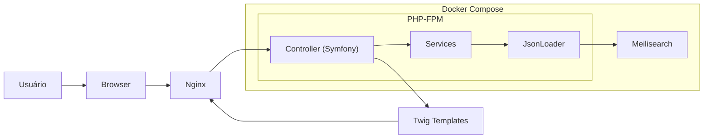
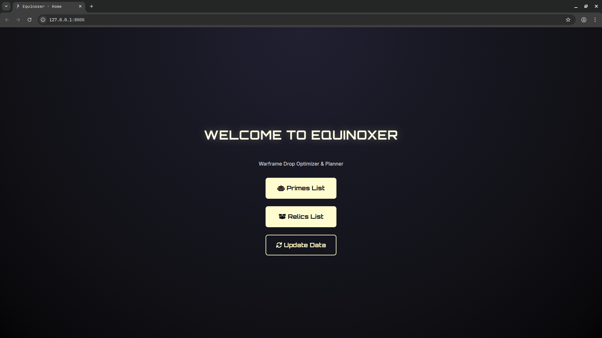
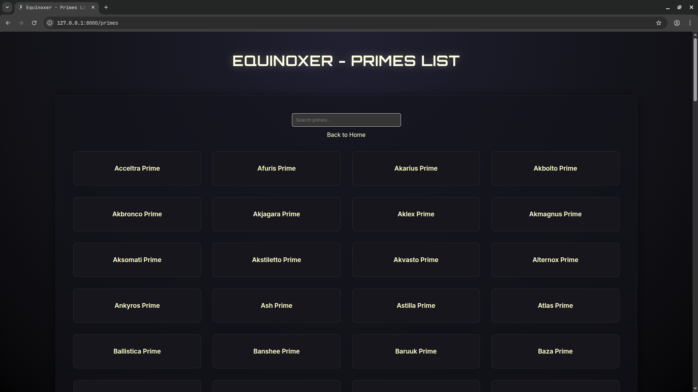
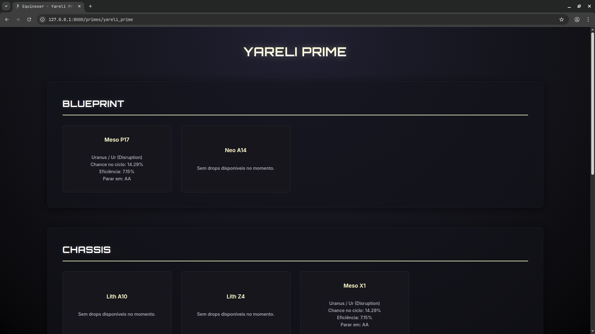
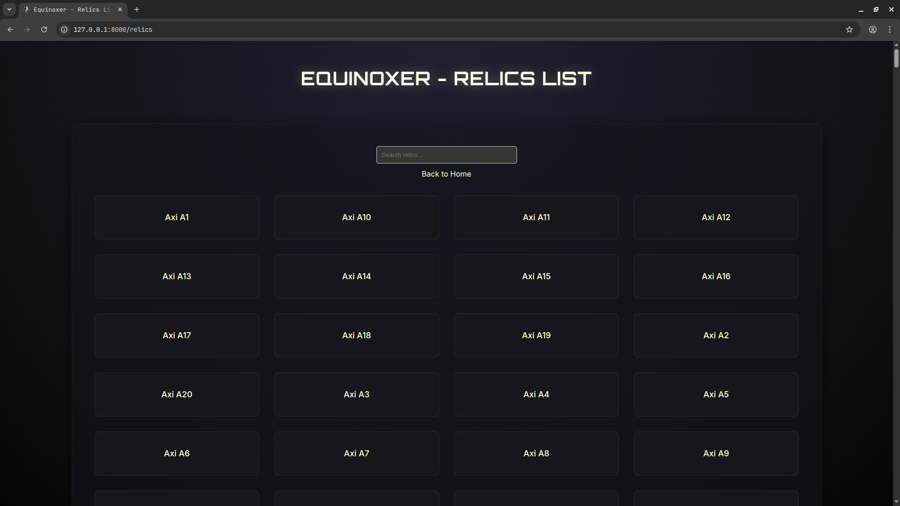
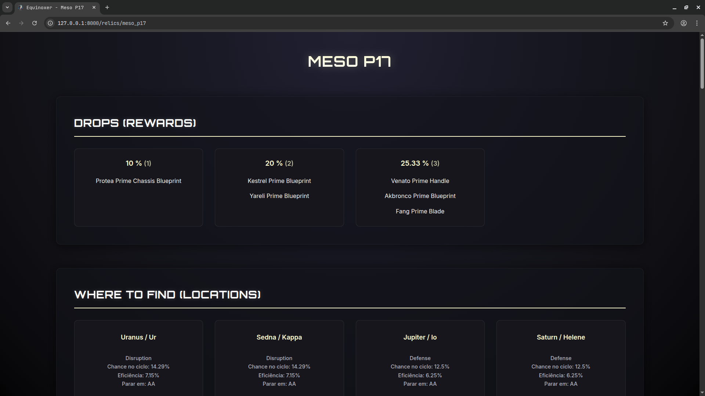
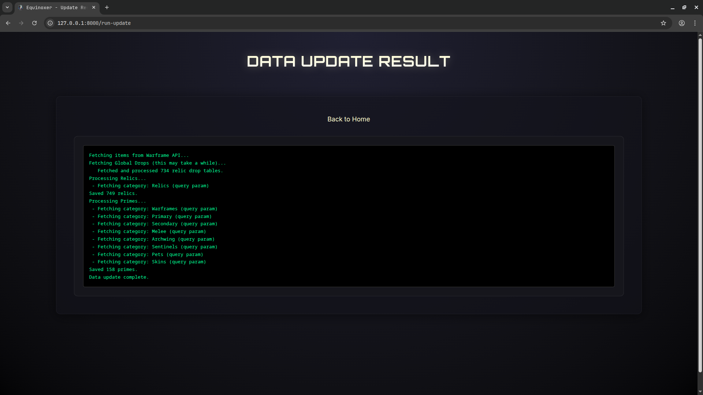

# 🌑🌕 Equinoxer


> **Uma plataforma otimizada para rastreamento de drops e relíquias de Warframe.**

**Equinoxer** é uma aplicação web desenvolvida em **PHP 8.3+ / Symfony 7.3**, criada para fornecer aos jogadores de Warframe uma maneira rápida, limpa e eficiente de planejar seus farms de itens Prime com o fator de eficiência que te da a melhor missão para farmar uma relíquia específica com base na chance de drop e tempo médio da rotação te informando a rotação mais eficiente para farmar a relíquia.

A interface utiliza uma estética moderna "Sci-Fi" com cores neon (Azul/Amarelo) inspirada na identidade visual do jogo e no warframe equinox prime, focando em usabilidade e performance.

## 🎯 Funcionalidades Principais

O projeto resolve o problema de navegar por wikis desatualizadas ou lentas, centralizando dados da API oficial e da comunidade.

| Feature de Jogo | Tecnologia / Implementação | Descrição |
| :--- | :--- | :--- |
| **Busca de Relíquias** | `Meilisearch` | Listagem completa de relíquias com busca instantânea e filtragem por era (Lith, Meso, Neo, Axi). |
| **Cálculo de Eficiência** | `DropEfficiencyCalculator` | Algoritmo que determina a melhor missão para farmar uma relíquia específica com base na chance de drop e tempo médio. |
| **Primes Tracker** | `Data Aggregation` | Visualização de todos os Warframes e armas Prime, com links diretos para as relíquias de seus componentes. |
| **Atualização Automática** | `Console Command` | Sistema de comandos (`app:update-data`, `app:load-data`) que sincroniza o banco de dados com a API `warframestat.us`. |

## 🏗️ Arquitetura do Sistema

O fluxo de dados segue uma estrutura MVC padrão do Symfony com Meilisearch como search engine:



## 🚀 Como Executar

### Com Docker (Recomendado)

```bash
git clone https://github.com/EduLoboM/Equinoxer.git
cd Equinoxer

# Suba os containers
docker compose up -d

# Carregue os dados no Meilisearch
docker compose exec app php bin/console app:update-data
docker compose exec app php bin/console app:load-data

# Acesse em http://localhost:8080
```

### Sem Docker (Desenvolvimento Local)

#### Requisitos

* **PHP** 8.3+
* **Composer**
* **Symfony CLI**
* **Meilisearch** rodando em `localhost:7700`

#### Instalação

```bash
git clone https://github.com/EduLoboM/Equinoxer.git
cd Equinoxer
composer install

# Configure as variáveis de ambiente
cp .env .env.local
# Edite .env.local com MEILISEARCH_URL e MEILISEARCH_KEY

# Atualize e carregue os dados
php bin/console app:update-data
php bin/console app:load-data

# Inicie o servidor
symfony server:start
```

## 📚 Estrutura do Projeto

```
src/
├── Command/
│   ├── LoadDataCommand.php       # Carrega dados no Meilisearch
│   └── UpdateDataCommand.php     # Baixa dados da API warframestat.us
├── Config/
│   └── MeilisearchConfig.php     # Configuração do cliente Meilisearch
├── Controller/
│   ├── HomeController.php        # Página inicial
│   ├── PrimeController.php       # Listagem e detalhes de Primes
│   ├── RelicController.php       # Detalhes de Relíquias
│   └── RelicListController.php   # Listagem de Relíquias
├── DTO/
│   ├── DropEfficiencyResult.php  # Resultado do cálculo de eficiência
│   ├── MissionDrop.php           # Dados de drop de missão
│   └── RelicDrop.php             # Dados de drop de relíquia
├── Service/
│   ├── DropEfficiencyCalculator.php  # Cálculo de eficiência de farm
│   ├── JsonLoader.php                # Interface com Meilisearch
│   ├── PrimeService.php              # Lógica de manipulação de Primes
│   └── WarframeLoot.php              # Lógica de drop tables
└── ValueObject/
    └── WarframeItemName.php      # Value object para nomes de itens
```

## 🧪 Testes

O projeto possui uma suíte completa de testes organizados em 4 categorias:

| Tipo | Descrição | Tecnologia |
| :--- | :--- | :--- |
| **Unit** | Testes isolados de Services, DTOs e ValueObjects | PHPUnit |
| **Integration** | Testes de rotas HTTP e renderização de templates | WebTestCase |
| **System** | Testes E2E simulando interação real do usuário | Panther + Chrome |
| **Api** | Testes que dependem de chamadas à API externa | PHPUnit (excluídos no CI) |

### Executar Testes

```bash
# Todos os testes (exceto API)
php bin/phpunit --exclude-group api

# Apenas testes unitários
php bin/phpunit tests/Unit

# Apenas testes de integração
php bin/phpunit tests/Integration

# Com cobertura de código
php bin/phpunit --coverage-text
```

### Análise Estática

```bash
# PHPStan (Level max)
composer analyse

# PHP-CS-Fixer
vendor/bin/php-cs-fixer fix --dry-run --diff
```

## 🔄 CI/CD

O projeto utiliza **GitHub Actions** com o seguinte pipeline:

1. **Setup** - PHP 8.4, Meilisearch service
2. **Install** - Composer dependencies
3. **Prepare** - Carregar dados no Meilisearch
4. **Style** - PHP-CS-Fixer (dry-run)
5. **Analyse** - PHPStan (level max)
6. **Test** - PHPUnit com cobertura

## 🔧 Destaques Técnicos

### HTTP Cache Headers

Todas as páginas públicas utilizam cache HTTP com `SharedMaxAge` (1h para CDN) e `MaxAge` (5min para browser), permitindo escalabilidade sem infraestrutura adicional:

### Meilisearch como Database + Search Engine

Uso do Meilisearch tanto como banco de dados primário quanto como search engine, eliminando a necessidade de um RDBMS tradicional:
- **Armazenamento de documentos** JSON-native para primes e relics
- **Busca full-text** com typo-tolerance
- **Filtragem instantânea** por atributos (tier, era)
- **Paginação eficiente** com limite de 10k documentos

## 📸 Screenshots

<div align="center">
  <table>
    <tr>
      <td align="center">
        
        <br>
        <b>Página Inicial</b>
      </td>
      <td align="center">
        
        <br>
        <b>Lista de Primes</b>
      </td>
    </tr>
    <tr>
      <td align="center">
        
        <br>
        <b>Detalhes do Prime</b>
      </td>
      <td align="center">
        
        <br>
        <b>Lista de Relíquias</b>
      </td>
    </tr>
    <tr>
      <td align="center">
        
        <br>
        <b>Detalhes da Relíquia</b>
      </td>
      <td align="center">
        
        <br>
        <b>Atualização de Dados Sucesso</b>
      </td>
    </tr>
  </table>
</div>

---

<p align="center">
Desenvolvido com 💖 por <b>Eduardo Lôbo Moreira</b>.
<br>
<i>Inspirado pelo melhor Warframe Equinox Prime.</i>
</p>
