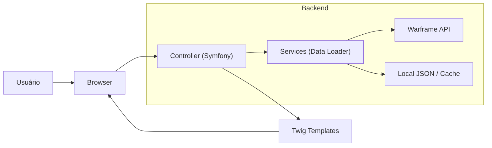

# 🌑🌕 Equinoxer


> **Uma plataforma otimizada para rastreamento de drops e relíquias de Warframe.**

**Equinoxer** é uma aplicação web desenvolvida em **PHP/Symfony**, criada para fornecer aos jogadores de Warframe uma maneira rápida, limpa e eficiente de planejar seus farms de itens Prime.

A interface utiliza uma estética moderna "Sci-Fi" com cores neon (Ciano/Verde) inspirada na identidade visual do jogo, focando em usabilidade e performance.

## 🎯 Funcionalidades Principais

O projeto resolve o problema de navegar por wikis desatualizadas ou lentas, centralizando dados da API oficial e da comunidade.

| Feature de Jogo | Tecnologia / Implementação | Descrição |
| :--- | :--- | :--- |
| **Busca de Relíquias** | `Cache System` | Listagem completa de relíquias com busca instantânea e filtragem por era (Lith, Meso, Neo, Axi). |
| **Cálculo de Eficiência** | `Math Logic` | Algoritmo que determina a melhor missão para farmar uma relíquia específica com base na chance de drop e tempo médio. |
| **Primes Tracker** | `Data Aggregation` | Visualização de todos os Warframes e armas Prime, com links diretos para as relíquias de seus componentes. |
| **Atualização Automática** | `Console Command` | Sistema de comando (`app:update-data`) que sincroniza o banco de dados local com a API `warframestat.us`. |

## 🗺️ Roadmap Futuro

* **v1.1** - Filtros avançados por Planeta e Tipo de Missão
* **v1.2** - Criação de "Wishlists" para rastrear sets completos
* **v1.3** - Integração com o Warframe Market para preços de platina
* **v1.4** - Sistema de contas de usuário para salvar progresso

## 🏗️ Arquitetura do Sistema

O fluxo de dados segue uma estrutura MVC padrão do Symfony:



## 🚀 Como Executar

### Requisitos

* **PHP** (versão 8.1 ou superior)
* **Composer**
* **Symfony CLI**

### Instalação

```bash
git clone https://github.com/EduLoboM/Equinoxer.git
cd Equinoxer
```

### Configuração e Execução

1.  Instale as dependências:
    ```bash
    composer install
    ```

2.  (Opcional) Atualize os dados locais:
    ```bash
    php bin/console app:update-data
    ```

3.  Inicie o servidor:
    ```bash
    symfony server:start
    ```
    Ou use o servidor embutido do PHP:
    ```bash
    php -S 127.0.0.1:8000 -t public
    ```

## 📚 Estrutura do Projeto

* `src/Command/UpdateDataCommand.php`: Comando para baixar e normalizar dados da API.
* `src/Controller`: Controladores para páginas de Home, Primes e Relíquias.
* `src/Service/WarframeLoot.php`: Lógica de busca e cálculo de drop tables.
* `templates/`: Arquivos de visualização Twig com tema customizado.
* `public/css/main.css`: Estilização global (Dark Theme + Neon).

---

<p align="center">
Desenvolvido com 💖 por <b>Eduardo Lôbo Moreira</b>.
<br>
<i>Inspirado pelo melhor Warframe Equinox Prime.</i>
</p>
